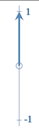
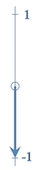
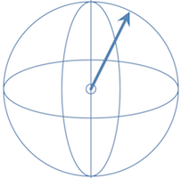

## The Notion of a Bit

It shouldn't be necessary to explain to programmers what a **bit** of information is. It's a concept so fundamental to computing that, if anything, it's taken almost for granted in modern day programming.

We often forget that in the earliest computers each bit of information required a clunky, power-hungry vacuum tube. Computing in those days was inefficient and error-prone. Vacuuum tubes were replaced by individual transistors which were, over time, miniaturised and packed, more and more tightly, into the integrated circuits which are the processors of today's laptops and smartphones.

Today's quantum computers are clunky, power-hungry and error-prone, like the vacuum tubes in their day. Do not be fooled, however, into thinking that this is a step backwards, in fact we'll see that the strange world of quantum mechanics brings immense benefits and even tiny quantum computers can produce results that traditional computing cannot.

When we consider single bits, we are used to seeing them represented with different symbols: 1/0, true/false or maybe even on/off. We call the possible values *states*, that is, an "on" state or a `true` state, etc.

Bits can also be be pictured geometrically, for example as an arrow pointing up from some origin to represent one binsry state and an arrow pointing down from the same origin to represent the the other binary state.
 
For now we will choose the terms `Up` and `Down` to avoid any misleading numerical or logical connotations and reenforce a geometric interpretation. But remember, the quantum world stubbornly refuses to fit with our human intuitions so don't take it too realistically[1].

  

With this in mind we reinterpret the familiar NOT operator or *gate* as simply flipping the arrow through 180º, from `Up` to `Down` and vice versa. In this space we’ve just invented, the NOT gate is an example of a *unitary operation* on the bit, that is to say, it changes the direction of the arrow but not its length. In fact in the classical world there are only two one-bit operations, the other being the *identity* operator which leaves the bit in its previous state and is obviously also unitary.

## Extending the Notion of a Bit

Now take a moment to imagine that the arrow is not confined to just the `Up` and `Down` states, as it is for a classical bit, but can point in *any* direction, left, right, front, back, etc. You’ve just imagined the all the possible states of a **quantum bit**.

This quantum bit, or **qubit** as it is usually called, is evidently not restricted to just two mutually exclusive states, as in the case of the classical bit, but rather a continuum of states over the whole surface of a sphere, so-called **Bloch sphere**.

Additionally, we can imagine a whole new family of gates which not only flip the arrow around 180º (like the classical NOT gate) but can rotate it by different angles into any direction[2].

## God *does* play dice

Now here’s the kicker. 

In the quantum mechanical world, when we make observations, those same observations affect the state of the system in fundamental ways. In this case, when we **measure** a quantum bit it will give us a classical `true` or `false`, *never anything in else*. It is said that the state "collapses" to one of these values[3]. What is more, the *probability* that it will give us one result or another is related directly to how close the arrow is to that state.

For example, if we identify the `Up` state as `false` and the `Down` state as `true` then if the arrow of our quantum bit is pointing up vertically it will be almost certainly be `false` when measured, if it’s pointing down it’s almost certain to be measured as a `true`. If its pointing sideways then it could result in either `True` or `False` with equal likelihood. It is indeterministic, God really does really play dice.

Believe it or not this view of a quantum bit has been fully validated by experiment. Specially prepared light particles, sub-atomic particles and even atoms behave in exactly this way. It leads to some very surprising results in its own right but the real power doesn't come until we combine multiple bits into a single state, as we shall see in the next section.

To go deeper into the maths and coding examples: [Representing the qubit](ex01%20-%20representing%20the%20qubit.md)

To continue to the next section: [Two Qubits and Entanglement](../02%20-%20Two%20Qubits%20and%20Entanglement/content.md)

### Footnotes

1. The `Up` and `Down` terminology is also reminicent of one of the quantum mechanical states of particlies called [spin](https://en.wikipedia.org/wiki/Spin_(physics)).
2. In the quantum computing literature these gates have (cryptic) names like `H`, `X`, `Y` and `Z`. In reality they are all nothing more than rotations of the arrow in different directions by different amounts.
3. No one really knows *why* this happens. There is evidence that when considering the measuring apparatus as a quantum mechanical system in itself then the collapse can be considered as altering the state on the whole system to bring both into alignment. Einstein famously was not convinced. It was shown in the 60s that the effect **cannot** be explained in terms of a single qubit, even theoretically, so called non-locality. This will be have interesting consequences for our simulator.
