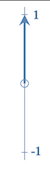
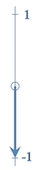

## Extending the Notion of a Bit

It shouldn't be necessary to explain to programmers what a *bit* of information is. It's a concept so fundamental to computing that, if anything, it's taken almost for granted in modern day programming.

We often forget that in the earliest computers each bit of information was represented using a clunky, power-hungry vacuum tube. Computing in those days was inefficient and error-prone. Vacuuum tubes were replaced by individual transistors which were miniaturised over time and then packed into integrated circuits which are the processors of today's laptops and smartphones.

To understand the world of quantum computing we'll need to return again to the level of individual bits. Do not be fooled, however, into thinking that this is a step backwards, in fact we'll see that the strange world of quantum mechanics brings immense benefits and can even produce results that traditional or *classical* bits cannot.

When we consider single bits, we are used to seeing them represented in different ways: 1/0, true/false or maybe even on/off. The possible values are called *states*, that is, an "on" state or an "off" state, etc. This representation can be pictured geometrically, namely as an arrow pointing up from some origin to represent the `true` state or an arrow pointing down from the same origin to represent the `false` state.
 
  

## Gates

With this in mind we reinterpret the familiar NOT operator or *gate* as simply flipping the arrow through 180º, from Up (`true`) to Down (`false`) and vice versa. In this space that we’ve just invented, the NOT gate is an example of a *unitary* operator on the bit, that is to say, it changes the direction of the arrow but not its length. In fact in the classical world there are only two one-bit operators, the other being the *identity* operator which leaves the bit in its previous state and is obviously also unitary.

Now let's imagine that the arrow is not confined to just the Up (`true`) and down (`false`) states, as it is for a classical bit, but can point in *any* direction. You’ve just imagined the all the possible states of a quantum bit or *qubit*.

This visual representation of a quantum bit is called the Bloch sphere and it’s evidently not restricted to just two mutually exclusive states, as in the case of the classical bit, but rather a continuum of states over the whole surface of a unit sphere.

Additionally, we can image a whole new family of unitary gates which not only flip the arrow around (like the classical NOT gate) but also rotate it by different angles into any direction. (In the quantum computing literature these gates have (cryptic) names like `H`, `X`, `Y` and `Z`. In reality they are all nothing more than rotations of the arrow in different directions by different amounts.)

## God *does* play dice

Now here’s the kicker. In the quantum mechanical world, when we make observations, those same observations affect the state of the system in fundamental ways. In this case, when we *measure* a quantum bit it will give us `true` or `false`, *never* anything in between. You will hear that the state "collapses" to one of these values[1]. What is more, the probability that it will give us one result or another is related directly to how close the arrow is to that state.

For example, if the arrow of our quantum bit is pointing up vertically it will be almost certain to be `true` when measured, if it’s pointing down it’s almost certain to be measured as a `false`. If its pointing sideways then it could result in either `true` or `false` with equal likelihood. It is *indeterministic*, God really does really play dice.

Believe it or not this view of a quantum bit has been fully validated by experiment. Specially prepared light particles, atoms and other mechanisms can be described in exactly this way. It leads to some very surprising and powerful results in it’s own right but the real power doesn't come until when we combine multiple bits into a single state, as we shall see in the next section.

Exercise 1: representing the qubit
Exercise 2: a quantum random number generator

### Footnotes

1. No one really knows *why* this happens. There is evidence that when considering the measuring apparatus as a quantum mechanical system in itself then the collapse can be considered as altering the state on the whole system to bring both into alignment. Einstein famously was not convinced. It was shown in the 60s that the effect **cannot** be explained in terms of a single qubit, even theoretically, so called non-locality. This will be have interesting consequences for our simulator.
