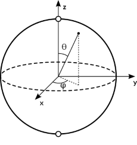

As we saw in the previous section, a qubit generalises a classical bit by representing it as an arrow of unit length pointing in any direction in a 3D space. The direction represents a particular *state* of the qubit. 

Therefore we can represent a qubit in code by a direction in 3D space. One way of doing this is to define two angles, for example the co-latitude θ and longitude φ, as in the diagram below.



Intuitively, the closeness of the arrow to `False` (straight up) should be some function of the angle between them, θ. In fact, the state is definitely `False` when θ=0 and is definitely **not** `False` when θ=π (180º). Similarly the arrow is definitely `True` when θ=π (180º) and is definitely **not** `True` when θ=0. 

Everywhere else, the state is combination or *superposition* of both `True` AND `False`, a bit of each.

(This kind of combination of states is popularised in the well known Schrodingers' cat thought experiment.)

So the amount of `False`ness goes from 100% when θ=0 down to 0% as θ goes to π (180º). That's a lot like the function *sin(θ/2)*.

Likewise the amount of `True`ness varies from 100% when θ=π down to zero when θ=0, that is the arrow is pointing straight up. That's a lot like the function *cos(θ/2)*.

It turns out, and this is borne out by experiment, that these functions are indeed the right way to describe the weights of `True` and `False` in the state.

What about φ? Mathematically we can use a complex factor of *e<sup>iφ</sup>* on either of the other weights to represent the angle. Using the imaginary number *i* is a mathematical trick to add another rotation and this is where the maths gets more heavy so we'll come back to this later. Given the high level of symmetry involved it turns out we can get a lot further without considering this angle yet.

Now as was mentioned earlier, God really does play dice. When a qubit is measured it *collapses* to either `True` or `False`, never anything in between, and it does this in an indeterministic way<sup>[2]</sup>. 

Quantum mechanics gives us the formula for calculating the probability of a given measurement. It is the square of the weight, namely, *cos<sup>2</sup>(θ/2)* for `False` and *sin<sup>2</sup>(θ/2)* `True`. Conveniently the sum of these trigonometric functions add up to exactly 100%, that is to say, the measurement will result in one of these outcomes and no other. Again this has been demonstrated beyond any possible doubt by numerous experiments.

We now have enough information to simulate a single qubit. Let's model these concepts in a feature test.

#### Step 1. Write a feature test which instantiates 100 qubits in the `False` state. *Measure* all the qubits and assert that the probability of each being `False` is 100%.
Hint: here is an example of what that test might look like in Java:
```java
	@Test
	void create_100_false_qubits() {
		assertTrue(streamFalse(qubitSource)
			.allMatch((qubit) -> qubit.measure() == false));
	}

	private Stream<Qubit> streamFalse(QubitSource qubitSource) {
		QubitSource qubitSource = new QubitSource();
		return Stream.generate(() -> qubitSource.prepareFalse())
			.limit(100);
	}
```
It uses Java's build in `Stream` class to generate 100 qubits prepared in the `False` state. It then ensures that all give the classical state `false` when measured. 

#### Step 2. Generate empty classes to make the test compile.
In the real world quantum bits must be prepared before use so the QubitSource class represents the aparatus to prepare the qubit. A Qubit class will also naturally be needed.

#### Step 3. Write a unit test for the QubitSource class.
This will initially just instanciate a new, empty Qubit object. We'll implement the `prepareFalse()` method to do that.

#### Step 4. Write a unit test for the Qubit class.
It will need a `measure` method/function which always returns `false`.

The feature test should now pass.

#### Step 5. Write a feature test which instantiates 100 qubits in the `True` state. *Measure* all the qubits and assert that the probability of each being `True` is 100%.
This test will be very similar to step 1 however we won't create qubits in the `True` state using a `prepareTrue()` method but rather use a 180º rotation (a `NOT` operation) of the `False` qubit.

Hint:
```java
	@Test
	void create_100_true_qubits() {
		assertTrue(Stream.generate(() -> qubitSource.prepareFalse())
            .map(() -> qubit.not())
			.limit(100)
			.allMatch((qubit) -> qubit.measure() == true));
	}
```
Create the new methods with empty implementations and make sure the test fails.

#### Step 6. Write a unit test for the Qubit class which represents a not *gate* by an operation on the qubit which rotates it by an angle of 180º.
By this stage Qubit will need a field representing the Qubit state internally and you will have to manipulate that state by simple operations. The measurement will check the state and return `true` or `false` accordingly.

#### Step 7. Write a feature test for a quantum random number generater.
```java
	@Test
	void quantum_random_number_generator() {
		assertBetween(40, 60, streamFalse()
			.map((qubit) -> qubit.halfNot())
			.filter((qubit) -> qubit.measure() == false)
			.count());
	}

	private void assertBetween(long lower, long upper, long actual) {
		assertTrue(actual >= lower && actual <= upper);
	}
```
The new `halfNot()` method rotates by 90º leaving the qubit in a half-`True`, half-`False` state, i.e. the probability of measuring the qubit as `True` or `False` is 50% in both cases.

#### Step 6. Write a unit test for the Qubit class which represents a not *gate* by an operation on the qubit which rotates it by an angle of 180º.
Prepare for the test by making sure that the internal state of the Qubit is represented by an angle, if you haven't already done so, and then run all the previous tests again. They should continue to pass. 

We saw earlier that the probability of a particular result is given by trigonometric funtions of its angle, namely, *cos<sup>2</sup>(θ/2)* for `False` and *sin<sup>2</sup>(θ/2)* `True`. Implement the `measure()` method using these functions. All tests should continue to pass.

The feature test should now also pass and we have simulated our first quantum system!


# Footnotes

2. This is one of the enigmas quantum mechanics. In fact, it is thought that the underlying "local" state of the qubit is hidden from view in a fundamental way. See Bell's Theorem.

# Glossary

1. *Unit* vector is often used in mathematics to mean "an arrow of length exactly 1.0". 
2. An a *unitary* operation means any operation on a unit vector which results in another unit vector. A rotation is one example.