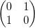
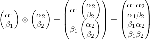

## Composing Two Qubits
Until now we have used a simplified representation of a **qubit** using only the angle θ to represent the state with weights *sin(θ/2)* and *cos(θ/2)* for the `False` and `True` components respectively. To generalise these ideas it is useful to write the weights of the components of the state as a vector, namely [*cos(θ/2)* *sin(θ/2)*]. 

For example, a qubit in state `False` can be represented as [1 0] and likewise a qubit in state `True` would be [0 1]. 

When we apply the NOT gate to these states it maps between them so 

NOT [1 0] -> [0 1] and NOT [0 1] -> [1 0]

There is a matrix which, when multiplied by the state vector, has this exact effect: 



In fact that there is a matrix, indeed a *unitary* matrix, for *any* mapping between states that we might imagine.

For example a very useful gate for quantum algorithms is the [Hadamard gate](https://en.wikipedia.org/wiki/Quantum_logic_gate#Hadamard_(H)_gate). It is defined as:


This gate is applied by simply multiplying its matrix by the state vector to create a new state vector. (The factor of √2 is required to ensure that the matrix is *unitary*, that is only the direction of the state vector is affected.)

We now have a convenient way to represent our qubits and gates so how do we combine two qubits? The state of a quantum register is a [special kind of product](https://en.wikipedia.org/wiki/Kronecker_product) of the states of the individual qubits and is defined like this: 



The physical mechanism behind this product is again up for philosophical debate. You may simply take it for granted as an empirical fact or axiom, you may prefer to use category theory to show its fundamental properties. Here we will just take it as a given. 

There are two main things to notice with this product. First there are four components (2<sup>2</sup>) in the resulting vector, as we would expect, each corresponding to a weight for each possible combination. These define the actual state of the 2-bit register.

The second thing to notice is it's recursive nature. This observation will let us make quantum registers of any size in a later exercise.

## Entanglement
As described above, the state of a quantum register may be expressed in terms of a product of the states of its qubits. However, *there is no general inverse*. That is to say **a quantum register may have a state that does not correspond to any possible combination of its individual qubits**.

This is an example of the weirdness of quantum mechanics and is the basis of something called entanglement. It's like the qubits have an *imaginary* state and what's more things that happen to one must affect others in the same register.

## Two qubit gates
How do we obtain the entanglement states? By applying special gates to the register as a whole. These gates will operate on all the qubits in the register at the same time and so must be 4x4 matrices. They must, of course, also be unitary.

We gan generate gates of this type by applying the same product rule to the gate matrices as we applied to the state vectors. For example, to apply the Hadamard gate to the first qubit an leave the second unchanged be apply the gate H*I to the register.

However, the gates that create entanglement are gates that *cannot* be represented as a product of separate single bit operations. The principal example is the **Controlled NOT** or **CNOT** gate. It is defined by this matrix:


This gate is not separable into operations on individual qubits and generates entanglement within the register.

## Partial measurement
One last thing needs to be covered before starting the exercise, that is how to measure a qubits within a register.

Say we have a register with weights *[10% 20% 30% 40%]* for each of the components of the state (`False`-`False` plus `False`-`True` plus `True`-`False` plus `True`-`True`) what is the chance of measuring a `True` on the first qubit? It's just the sum of the third and fouth components, i.e. *30% + 40% = 70%*.

## Quantum Superdense Encoding
One application of 2 entangled qubits is in an encoding scheme where one previously entangled qubit can transmit 2 classical bits of information with a single qubit in a fundamentally secure way.

There are 3 steps to the process:
1. Someone, lets call them Eve, prepares 2-qubit pairs in an entangled state. The first qubit from each pair is sent to a transmitter, say Alice, and the second qubit from each pair is sent to a receiver, say Bob. This may be done in advance and the transmitter and receiver may be separated by any distance.
2. Alice applies a gate to her qubit. The gate is selected based on the 2 bits of classical information she wants to transmit. For example, for the bits 01 she applies the NOT gate, and for 8 bits of classical information required to encode the characher, say `H`, only 4 qubits are needed.
3. Bob receives the qubit from Alice combines it with the qubit that he was given earlier and measures them to recover the classical information.

It's fundamentally secure because if someone tries to measure the Alice's qubit in transit then the entanglement AND the information will be lost forever.

Notice that is seems as it half the information is retained in Bob's qubit even though Alice never has any contact with it whatsoever.

Let's simulate this interaction stating with a feature test.


#### Step 1. Write a feature test which covers the 3 step process defined above.

As a hint, this is an example feature test Java:
```java
    @Test
    void transmit_ascii_character_h() {
        QubitSource eve = new QubitSource(new Random(1));

        // Eve prepares 4 2-qubit pairs in Bell state
        Stream<Qupair> qupairs = Stream.generate(eve::prepareBellState).limit(4L);

        // Alice, given just the first qubit in each pair, encodes ASCII character 'H' => 0x48 => 01 00 10 00 => X I Z I
        SuperdenseEncoder alice = new SuperdenseEncoder(qupairs.map(Qupair::first));
        alice.encode((byte)0x48);

        // Bob, given the recombined pairs, recovers the information sent by Alice
        SuperdenseDecoder bob = new SuperdenseDecoder();
        assertThat(bob.decode(qupairs)).isEqualTo(0x48);
    }
```

Once again we have a `QubitSource` class but this time it prepares `Qubits` in pairs, `Qupairs`, in an entangled state called a Bell state.

We have a `SuperdenseEncoder`, namely Alice which, given the first qubit of the pair applies some gate it it based on the information she wants to send.

Thirdly we have a `SuperdenseDecoder`, Bob, who given Alice's encoded qubit and the second entangled qubit can recover the information.

Once again we use Java 8's `Stream` class. You may prefer to use a normal `List` or some other language.

#### Step 2. Generate the missing code so that the test compiles but don't implement anything yet.

