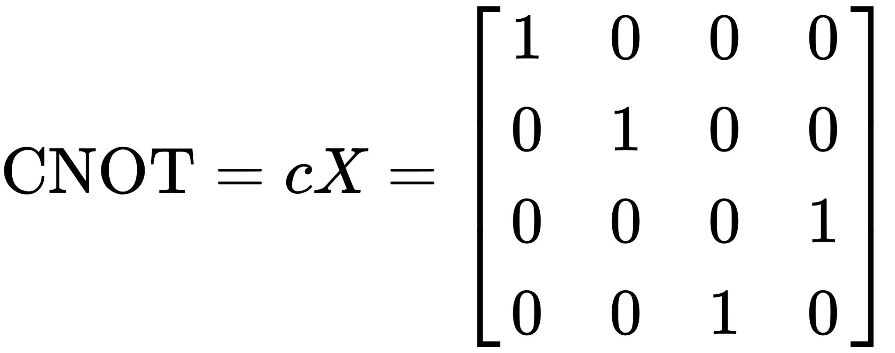

## Composing Two Qubits
Until now we have used a simplified representation of a **qubit** using only the angle \theta to represent the state and *sin(θ/2)* and *cos(θ/2)* are the weights of the `False` and `True` components respectively. To extend this representation to more qubits it is useful to write the weights of the components of the state as a vector, namely [*sinth* *costh*]. 

For example, a qubit in state `False` can be represented as [1 0] and likewise a qubit in state `True` would be [0 1]. 

When we applied the NOT gate to these states it mapped between them so 

NOT [1 0] -> [0 1] and NOT [0 1] -> [1 0]

There is a matrix which when multiplied by the state vector has this exact effect:  and in fact it turns out that there is a matrix for *all* the different gates we can imagine. 

For example a very useful gate for quantum algorithms is the [Hadamard gate](https://en.wikipedia.org/wiki/Quantum_logic_gate#Hadamard_(H)_gate). It is defined as:

This gate is applied by simply multiplying his matrix by the state vector to create a new state vector. The factor of of the square root of 2 is required to ensure that the matrix it *unitary*, that is only the direction of the state vector is affected.

We now have a nice way to represent our qubits and gates so how do we combine qubits? A quantum register is a [special kind of product](https://en.wikipedia.org/wiki/Kronecker_product) of individual qubits state vectors defined like this: 

The physical mechanism behind this product is again up for philosophical debate. You may simply take it for granted as an empirical fact or axiom, you may prefer to use category theory to show its fundamental properties. Here we will just take it as a given. 

There are two main things to notice with this product. First there are four components (22) in the resulting vector, as we should expect, each corresponding to a weight for each possible combination. These define the actual state of the 2-bit register.

The second thing to notice is it's recursive nature. This observation will let us make quantum registers of any size in a later exercise.

## Entanglement
As described above, the state of a quantum register may be expressed in terms of a product of the states of its qubits. However, *there is no general inverse*. That is to say **a quantum register may have a state that does not correspond to any possible combination of its individual qubits**.

This is an example of the weirdness of quantum mechanics and is the basis of something called entanglement. It's like the qubits have an *imaginary* state and what's more things that happen to one must affect others in the same register.

## Two qubit gates
How do we obtain the entanglement states? By applying special gates to the register as a whole. These gates will operate on all the qubits in the register at the same time and so must be 4x4 matrices. They must, of course, also be unitary.

We gan generate gates of this type by applying the same product rule to the gate matrices as we applied to the state vectors. For example, to apply the Hadamard gate to the first qubit an leave the second unchanged be apply the gate H*I to the register.

However, the gates that create entanglement are gates that *cannot* be represented as a product of separate single bit operations. The principal example is the **Controlled NOT** or **CNOT** gate. It is defined by this matrix:

This gate is not separable into operations on individual qubits and generates entanglement within the register.

## Partial measurement
One last thing needs to be covered before starting the exercise, that is how to measure a qubits within a register.

Say we have a register with weights *[10% 20% 30% 40%]* for each of the components of the state (`False`-`False` plus `False`-`True` plus `True`-`False` plus `True`-`True`) what is the chance of measuring a `True` on the first qubit? It's just the sum of the third and fouth components, i.e. *30% + 40% = 70%*.
